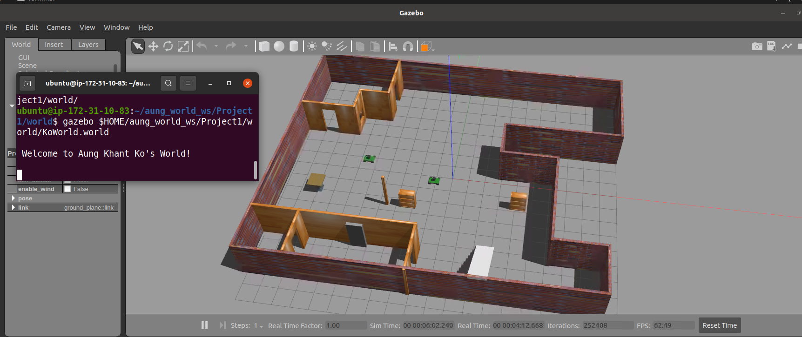

# Project 1 • Build My World 🏠🤖

Use **Gazebo** to simulate a small building that will eventually house a mobile robot.  

<p align="center">
  
</p>

---

## Table of Contents
1. [Project Overview](#project-overview)
2. [Directory Structure](#directory-structure)
3. [Requirements](#requirements)

---

## Project Overview
* Design a **single‑floor building** in Gazebo *Building Editor*.  
* Create a **custom robot** (Akkobot) and props in *Model Editor*.  
* Develop a **world plug‑in** (`welcome_message.cpp`) that prints a greeting on startup.

The resulting world launches with:

```bash
gazebo ~/aung_world_ws/Project1/world/KoWorld.world
```

and prints:

```
Welcome to Aung Khant Ko's World!
```

---

## Directory Structure
```text
Project1/
├── model/                 
│   └── Akkobot/…
├── script/                
│   ├── welcome_message.cpp
│   └── CMakeLists.txt
├── world/                 
│   └── KoWorld.world
└── docs/
    └── images/
        └── gazebo_world_screenshot.png
```

---

## Requirements

| Software | Tested Version |
|----------|----------------|
| Ubuntu   | 20.04 LTS      |
| ROS      | Noetic (`ros-noetic-desktop-full`) |
| Gazebo   | 11.x           |
| CMake    | ≥ 3.10         |
| gcc/g++  | ≥ 9            |

---


## Credits
**Author:** [Aung Khant Ko](https://github.com/akkexd)  


<p align="center">© 2025 Aung Khant Ko — Released under the MIT License.</p>
